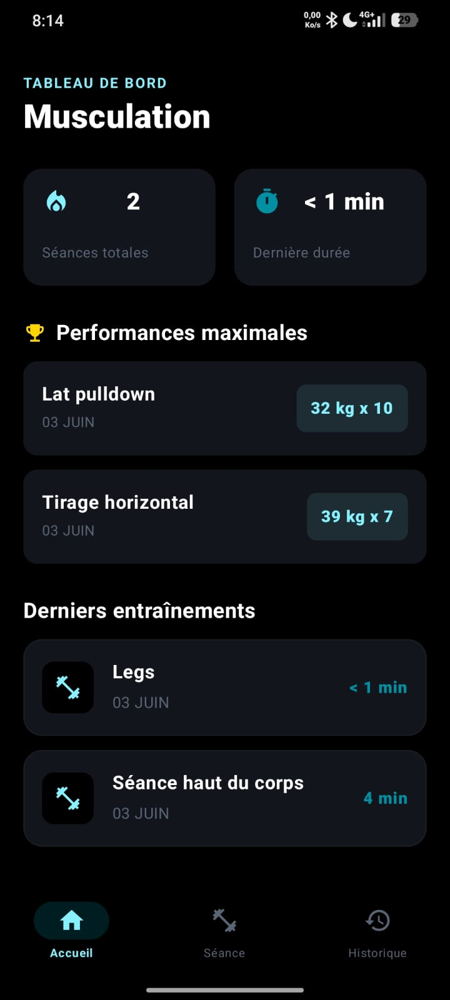
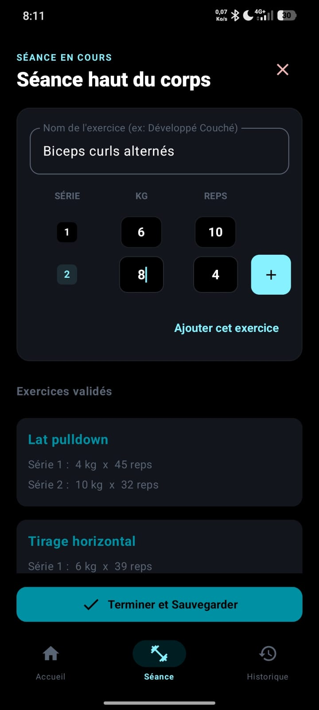
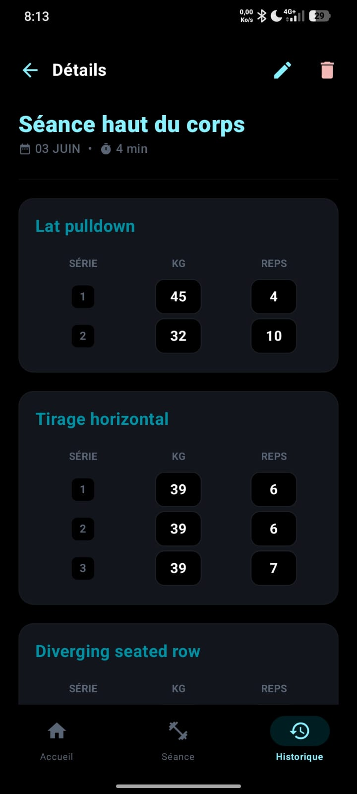

# App-mobile-musculation

Une application Android native conçue pour le suivi des entraînements de musculation et l'analyse des performances au fil du temps.

## Fonctionnalités

* **Suivi en temps réel :** Enregistrement des exercices, séries, poids et répétitions pendant la séance.
* **Tableau de bord :** Visualisation des statistiques globales et des meilleures performances.
* **Historique complet :** Consultation détaillée des entraînements passés.
* **Gestion des données :** Modification et suppression des séances enregistrées pour maintenir un historique précis.
* **Mode hors-ligne :** Sauvegarde locale des données ne nécessitant aucune connexion internet.

## Technologies Utilisées

* **Langage :** Kotlin
* **Interface Graphique :** Jetpack Compose (Material Design 3)
* **Base de données :** Room (SQLite)
* **Architecture :** MVVM (Model-View-ViewModel)

## Aperçu de l'application

  
  
  

